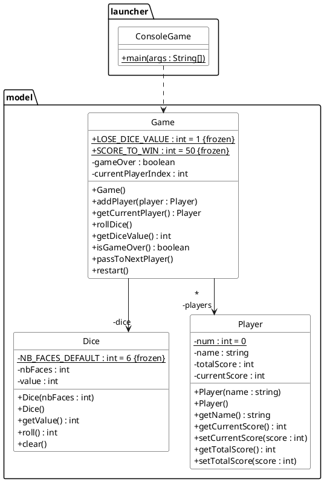

# La course de dé (version JavaFX)

L'objectif de ce TP est d'ajouter une interface graphique au jeu de dé que vous avez codé en C++ en première année. Pour rappel :

>  La « course de dé » se joue en lançant un dé. Les joueurs jouent tour à tour (pour ce TP nous nous limiterons à deux joueurs). Lorsque c'est à son tour, le joueur lance un dé et, tant qu'il ne fait pas 1, accumule les points des lancers successifs. S'il fait 1, il perd les points qu'il avait accumulés pendant son tour de jeu et la main passe, c'est à l'autre joueur de jouer. Un joueur peut sciemment décider d'arrêter de lancer le dé et ainsi sécuriser le score de son tour de jeu. Le premier joueur qui atteint un score de victoire (par exemple 50) gagne.

Afin de vous concenter sur l'interface graphique, nous vous fournissons la version Java du jeu que vous avez codé en C++. La conception de ce dernier est rappelé ci-dessous.

